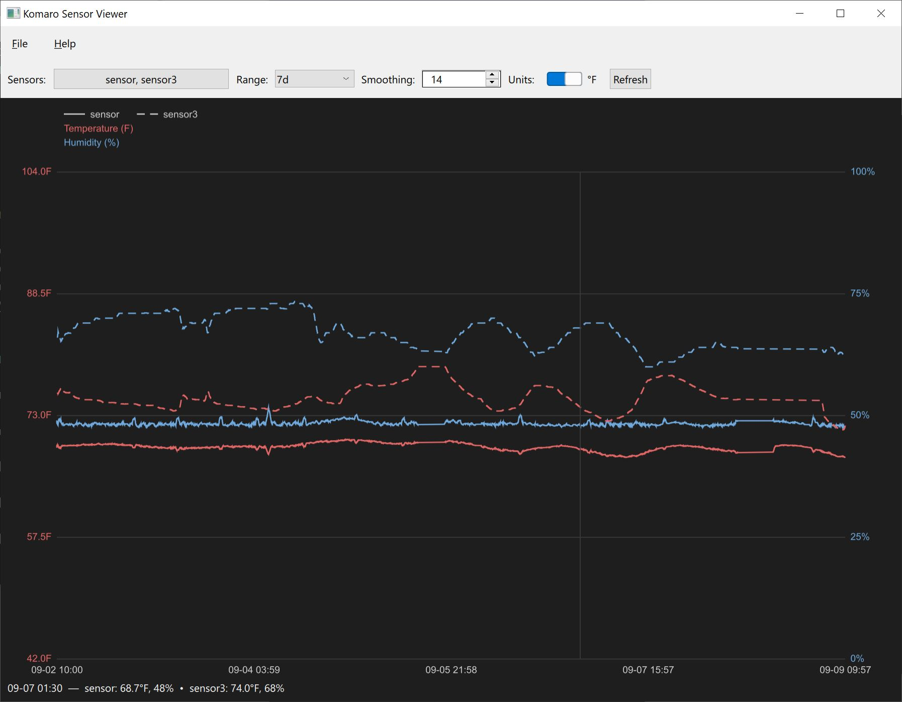
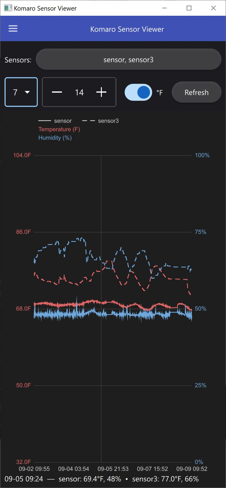
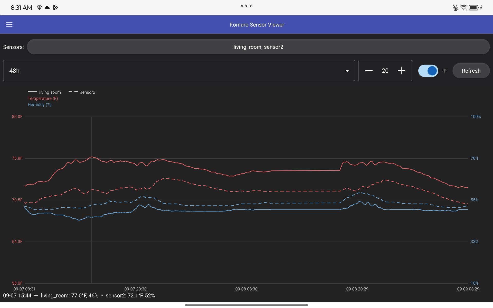

# Qt/QML based apps

A QML app to display temperature/humidity plots from InfluxDB, targeting desktop and Android, similar in purpose to the `nano/plot_sensor.py` / `nano/plot_multi_sensor.py` Python scripts.

## Status

Desktop skeleton in `desktop/`: a Qt Quick `ApplicationWindow` with `File`/`Help` menus and a chart filling the space below the menu bar. The app's actions (Connect, About, Exit) live in `core/qml/AppActions.qml` (the `KomaroCore` QML module) rather than being hardcoded in `desktop/qml/Main.qml`, so `Main.qml` is just a "thin shell" that arranges those shared actions into a `MenuBar`. Connect is wired end-to-end: an editable history combo box (backed by `core/`'s `ConnectionManager`, persisted via `QSettings`) records the selected host, and a controls row (measurement, time range, moving-average window) drives `core/`'s `ChartController` to query InfluxDB and feed the result into `core/qml/SensorChart.qml` — a hand-rolled `Canvas` dual-axis (temperature/humidity) line chart shared with the mobile shell, mirroring `nano/plot_sensor.py`.

`mobile/` is the second shell for that same shared `AppActions`: a `ToolBar`+`Drawer` (Material Dark) presentation instead of a `MenuBar`. It builds two ways: as a desktop app for quick UI iteration, and as a real Android `.apk` (Qt 6.8.3 `android_arm64_v8a` kit + NDK r26b) — see `mobile/README.md` for the Android toolchain setup and `TODO.md` for what's still outstanding (on-device testing).

## Screenshots

Desktop (`MenuBar` shell):



Mobile (`ToolBar`+`Drawer` shell, run in desktop mode):



Mobile, running as a real Android APK on a Lenovo Tab M11, showing a live 48h chart (1103 points) queried from InfluxDB on-device, with the °F units toggle enabled:



## Backend

Starting with a C++ backend (native Qt Quick app, CMake + Qt for Android). Other backends (e.g. PySide6/Python, reusing the existing `nano/` InfluxDB query code) may be added later.

## Desktop build

Qt 6.8.3 (LTS) is installed directly at `E:\qt6\6.8.3\msvc2022_64` and used via `CMAKE_PREFIX_PATH`. `desktop/CMakeLists.txt` pulls in `../core` via `add_subdirectory` and links it into the app. Using the CMake bundled with Visual Studio 2022 and the `windows-msvc` preset in `desktop/CMakePresets.json`:

```
cd qml/desktop
cmake --preset windows-msvc
cmake --build --preset windows-msvc-debug
ctest --preset windows-msvc-debug
```

Executables land in `build/windows-msvc/bin/<Config>/`, libraries in `build/windows-msvc/lib/<Config>/`. After a successful build, `windeployqt` runs automatically as a post-build step, so `komaro_qml_desktop.exe` is self-contained (no manual PATH/deploy step needed).

`desktop/vcpkg.json` (against the vcpkg instance at `G:\opt\vcpkg`) currently only pulls in `gtest`, needed to build `core`'s tests as part of this project; it isn't wired into `CMAKE_PREFIX_PATH`, so Qt itself is not built from source via vcpkg. Tests are gated by the `BUILD_TESTS` cache variable (default `ON`); pass `-DBUILD_TESTS=OFF` to skip them.

`cmake --install build/<preset> --prefix <dir>` produces a redistributable copy of `komaro_qml_desktop` in `<dir>` - it deploys Qt's runtime dependencies into the install tree the same way the POST_BUILD step does for the build tree, using `windeployqt` on Windows and Qt's cross-platform "generic deploy tool" on Linux (so it isn't a Windows-only no-op like the POST_BUILD step is on Linux). On Linux the real binary installs to `libexec/` and `bin/komaro_qml_desktop` is a thin wrapper script that sets `LD_LIBRARY_PATH` before exec-ing it - see `qml/KB.md` for why that's necessary. The default install prefix on the `linux-ubuntu` preset is `$HOME/.local`; run `cmake --install build/linux-ubuntu` with no `--prefix` to install there directly.
